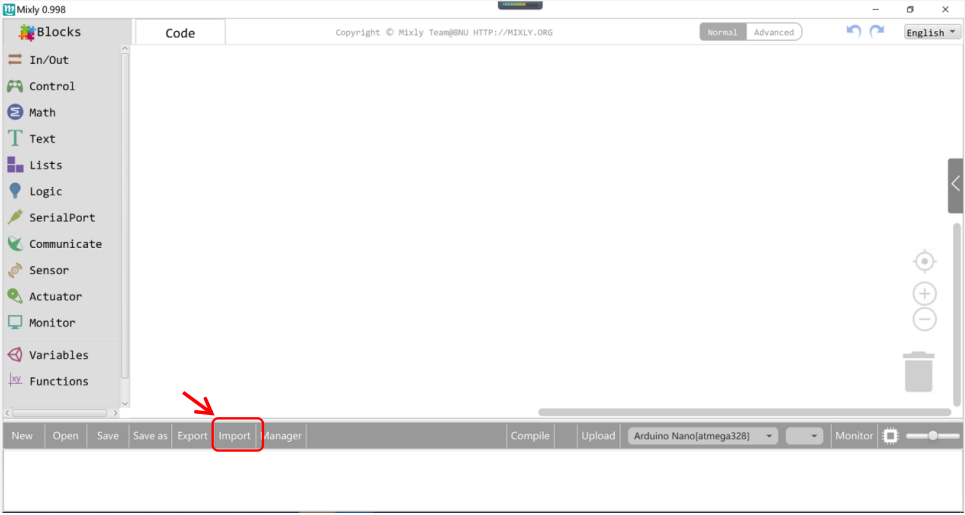
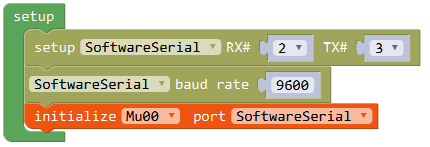
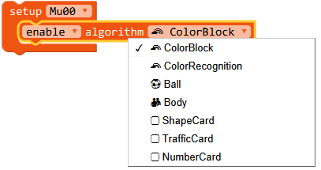
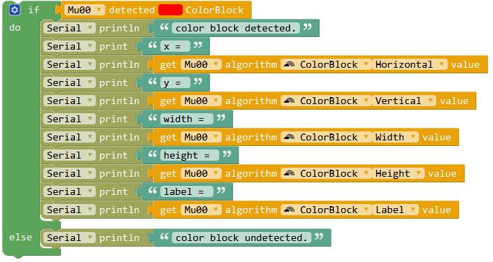
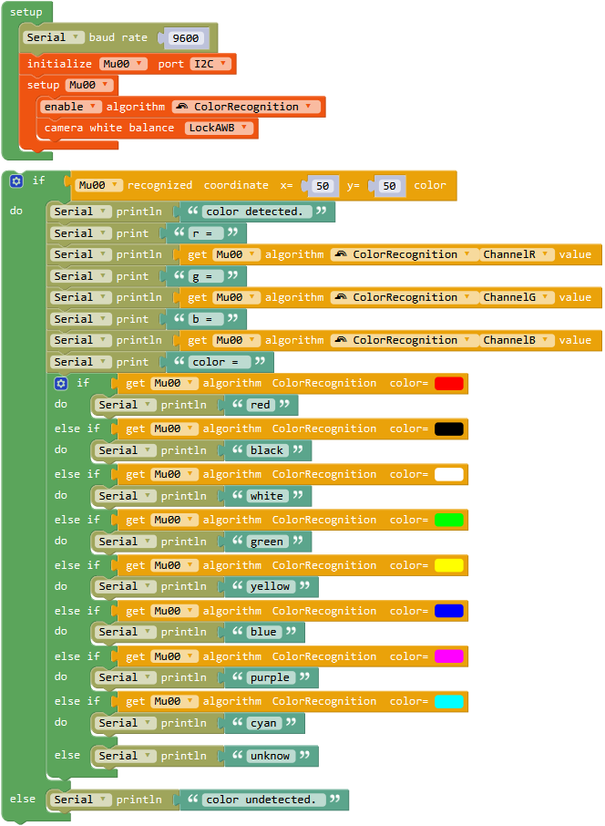
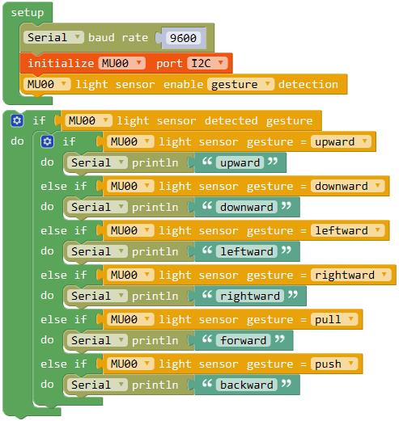

# Import Mixly Library for MU Vision Sensor 3

Open Mixly and choose controller.For example, choose Arduino Uno. 
If you use MoonBot controller, choose Arduino Mega(atmega 1280) and choose the available COM port.

Click ‘Import’.

Locate the ‘MuVisionSensor3.xml’ file , select and open it.

Then the nether information window prompts” import custom Library successfully ”, and you will find ‘MuVisionSensor3’ library in the ‘Blocks’ window.

# Connect to Arduino

MU Vision Sensor 3 periphrals and ports:

## I2C Mode (recommended)

1. Output Protocol Switch: set switch 1 downwards and switch 2 upwards.

2. Connect the output SDA pin of MU to the SDA pin of Arduino, and SCL pin of MU to SCL pin of Arduino.

3. Choose the I2C address of MU by setting Address Switch. Both switches are downwards and the address is set to 0x60 on default.
 (Changing this setting is not recommended).

## Serial Mode*

1. Output Protocol Switch: set both switchs downward.

2. Connect the output RX pin of MU to TX pin of Arduino and TX pin of MU to RX pin of Arduino.

3. Change the UART address of MU sensor by resetting Address Switch. Both switches are downwards and the address is 0x60 on default.
 (Changing this setting is not recommended)

*Arduino UNO cannot send messages to PC when MuVisionSensor is running in hardware serial mode, due to a communication conflict.*

## AT Command Mode (For firmware after V1.1.5)

1. Output Protocol Switch: set switch 1 upwards and switch 2 downwards.

2. Connect the output RX pin of MU to TX pin of Arduino and TX pin of MU to RX pin of Arduino.

## Image Transmission Mode (For firmware after V1.1.5)

1. Output Protocol Switch: both switchs are upwards.

2. Connect the output RX pin of MU to TX pin of Arduino and TX pin of MU to RX pin of Arduino.

# Block Introduction

## Setting Blocks

### Initialization

1. Hardware Serial Mode: Vision sensor uses serial mode to initialize the main control when connecting the main control hardware serial port. 
The serial port is the serial communication between the main control and the computer. 
When it is used for vision sensor, computer printing characters will be disordered or communication abnormalities.

2. Software Serial Mode: Vision sensor uses serial mode, and the main controller is initialized when connecting the main control software serial port. 
The main controller can customize RX and TX pins. 
The speed of soft serial port in real environment may be too fast and unstable. The baud rate is not recommended to exceed 9600.

3. Hardware I2C Mode: The vision sensor uses I2C mode to initialize the main controller when connecting the main controller I2C pins.

### Enable Vision Algorithms

### Algorithm performance level

### Enable/Disable the High FPS Mode

In high FPS mode, detect speed and power consumption will increase.

### Set White Balance Mode

Adjust the image bias caused by the change of external light source.

### LED Settings

### Restore Default Settings

Disable all algorithms and restore hardware default settings.

### Get Result Blocks

1. Ball/Body Detection

2. Card Detection

3. Color Block Detection

4. Color Recognition

## Light Sensor Blocks

### Enable Light Sensor

Enable light sensor functions. Gesture detect function can not work together with other functions.

### Set Sensitivity

Set light sensor sensitivity, only working in Proximity/Ambient Light Detect.

### Get Proximity Value

Read proximity value. Closer the distance, bigger the value.

### Read Ambient Light Value

Lighter the ambient light, bigger the walue.

### Read Detected Gesture or Not

Read whether detected gesture. If not detected, return 0.

### Judge Detected Gesture

Judge type of the detected gesture.

## WiFi Module Blocks

### *WiFi AT command Settings*

*Blocks below only works in image transmission or AT command mode*.

### WiFi Initialization

Initial WiFi port and baudrate.

### Configure WiFi

Set account and password of WiFi.

### Connect/Establish WiFi

Try connect to WiFi or establish WiFi and return conncetion result.

### Disconnect WiFi

### Set target IP

### Read target IP

### Read local IP

Get IP of MU.

### WiFi Read

Get data that target IP sent to MU.

### WiFi Write

Send data to target IP.

# Examples

## Color Recognition

## Ball Detection

## Card Detection

## Light Sensor - Gesture Detect

## Light Sensor - Proximity/Ambient Light Detect

## Connect to WiFi through AT Command

# FAQs

1. Q: What should I do if I can’t open programming blocks or blocks are black boxes?

A: Please download the latest Mixly program file and import the library again.

2. Q: What should I do when I import the library and download the examples correctly, but the vision sensor doesn’t respond and the serial port output nothing?

A: Check whether the cable is correctly and tightly connected .

Check whether the white light on the back side is on. If this light is not on ,this means something wrong with power supply.

Check whether the output mode switch and address switch are correctly setted.

It takes MU sensor a period of time to initialize after power-on , we suggested to add a delay of not less than 500 ms before calling ‘setup’ block in your program.

After reset, the two LEDs on the front side of MU vision sensor will flicker once. Red light indicates that the current mode is serial mode, green light indicates that the current mode is I2C mode. If the color does not go with the setting of output mode switch, please reset this switch.

3. Q: What should I do if I download the program and the serial port output correctly, but the LED does not light?

A: When the color recognition algorithm runs, the LED lights will be shut down in order not to interfere with the recognition results.  

Calling the LED setting block and alter the brightness parameter with non-zero number.

4. Q: Why there are some fuctions which can be found in the datasheet while are not listed in Mixly library?

A: In order to make the library easy to understand and operate, some uncommon functions are removed from the Mixly library, and some parameter setting methods are simplified. If these functions are needed, please email to support@morpx.com.

5. Q: Why the previously downloaded recongnition algorithms have impact on the current running program? For example download ball detection algorithm after running color recognition algorithm ,you will find the LEDs are still on even if the ball is not recognized, but this will not occur when only ball recognition algorithm was downloaded. 

A: Because the previous algorithm is not terminated even if the program ends, you can add ‘setDefault’ block when calling ‘setup’ block or restart MU vision sensor.