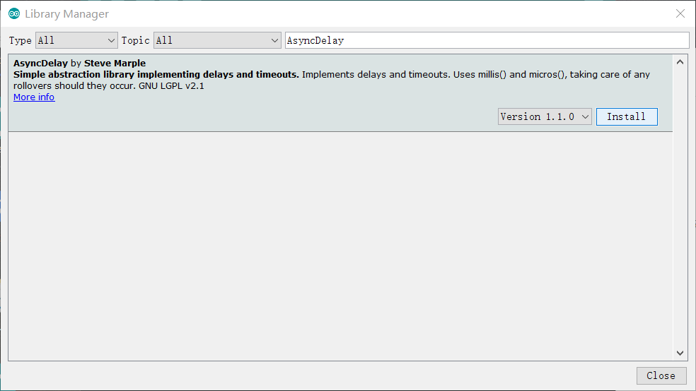

MoonBot Kit Arduino Guidelines for Building Development Environment
============================

MoonBot Kit(hereinafter referred to as MoonBot)provide Arduino library functions,Support for development programming on Arduino (ATmega1280)

This document aims to guide users to build MoonBot hardware development environment based on Aduino official IDE.

## Preparation

Hardware:

- MoonBot Developer Suite
- PC (Windows,Linux or Mac OS)

Software:

- [Arduino Official IDE](https://www.arduino.cc/en/Main/Software?setlang=cn)
- MoonBot Arduino library

## Detailed installation steps

### First step：MoonBot Import Arduino External Dependency Library 

- 1.Start Arduino official IDE
- 2.Click on `Project - > Load Library - > Manage Library',open  `Library Manager'.`

    

- 3.Search library `AsyncDelay', install the relevant library if not installed, update if the library is updated

    

- 4.Install the library `Software Wire'`Adafruit_NeoPixel' `Servo according to the installation method in step 3`, Ensure that the relevant libraries are installed in the latest version

### Step 2: import MoonBot Arduino library

- 1.Download the latest [MuVisionSensor3](https://github.com/mu-opensource/MuVisionSensor3/releases/latest) Arduino library and[MoonBot](https://github.com/mu-opensource/MoonBot/releases/latest) Arduino library(Source code(zip))
- 2.Click on the `Project - > Load Library - > Add. zip Library', select the MounBot Arduino Library downloaded in the first step, complete the import of the library.

    

- 3.Repeat the previous step and import the MuVisionSensor3 Arduino library to complete the library import

### Step 3: Connecting devices

Now connect your MoonBot to PC,Device connection and port configuration

- 1.Click on Tool - > Development Board , select``Arduino/Genuino Mega or Mega 2569`
- 2.Click on Tool - > Processor ,select`ATmega1280`
- 3.Click on Tool - > Port`,Select the corresponding MoonBot port

    Generally, serial ports display different names under different operating systems:

    - **Windows Operating System: ** `COM1` etc.
    - **Linux Operating System:** Start with `dev/tty'.
    - **MacOS Operating System:** Start with `dev/cu‘ .

### Step 4: Compile routines

- 1.Click on `File - > Example - > MoonBot',select one of the routines

    

- 2.Click on the upload button. If everything goes well, the development board will be reset and the corresponding routine will start running after the burning is completed.
