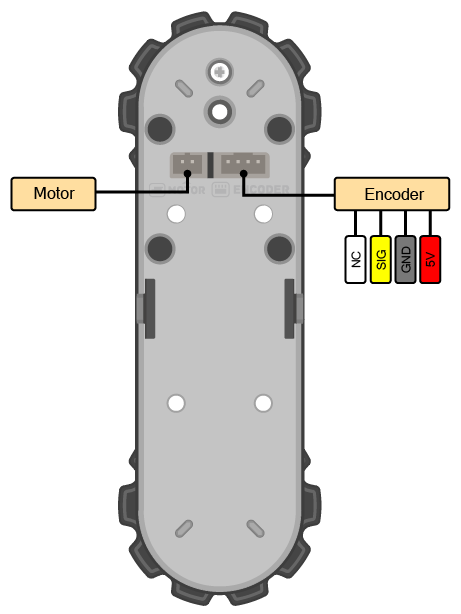
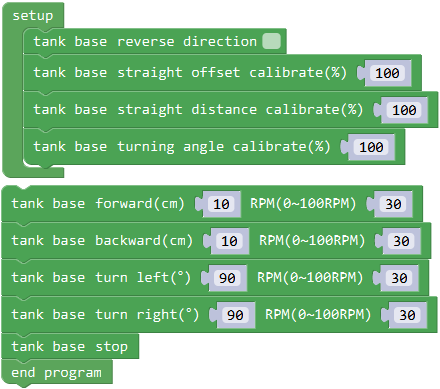
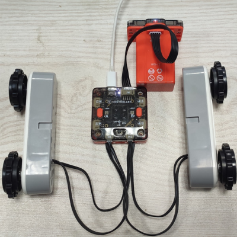

# Motor Module

## Brief Introduction

Motor module contains a gear motor and an encoder inside.The active wheel is connected to gear motor, while the passive wheel is connected with screw and bearings. 

The wheels are attached to track, and two whole motor modules are enough to build a Chassis.

## Specification

Size: 109 x 40 x 39.1 mm

Reducer: 120:1

Unloaded Speed: 100rpm

Unloaded Current: 150rpm

Rated Speed: 70rpm

Rated Current: 300mA

Encoder: photoelectric encoder

Connector: PH2.0 2P + PH2.0 4P

### Pinout

## Usage

### Chassis Control

Under structures as MoonRover, MoonBot and MoonMech, chassis can be controlled to go forward , go back and turn around.
Run the following program to test it.

Hardware connection: Connect the motors and encoders to the controller. Motor port M1 corresponds to encoder port P4, and M2 corresponds to P6.
Motor module is a high-power device and controller should be connected to battery to drive motor.
The controller can be connected to battery and USB at the same time and uses battery as power source.

Code introduction: In setup part, the direction of chassis is set, bias of direction, distance and turning radius is corrected.
In loop part, Chassis goes forward, back, turns left and right.Conrtol the distance and angle by setting motor speed. End the program at last.

Photo: 

### Single Motor Control

Except for controlling the whole chassis, motor 1 or 2 can be directly controlled.

Hardware connection: Same as above.

Code introduction: In initialize code, serial port is opened to send encoder data. Write value and control motor voltage through PWM for 2 seconds.
Then write motor speed with encoder feedback for 2 seconds. And the controller send encoder data through serial port.Write 0 to stop the motor.

