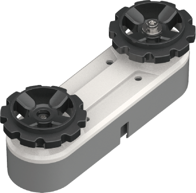

# Motor Module

## Brief Introduction

Motor module contains a gear motor and an encoder inside.The active wheel is connected to gear motor, while the passive wheel is connected with screw and bearings. 

The wheels are attached to track, and two whole motor modules are enough to build a Chassis.

## Specification

Size: 109 x 40 x 39.1 mm

Reducer: 120:1

Unloaded Speed: 100rpm

Unloaded Current: 150rpm

Rated Speed: 70rpm

Rated Current: 300mA

Encoder: photoelectric encoder

Connector: PH2.0 2P + PH2.0 4P

**Piout**

## Usage

### Chassis Control

在车形、人形、机械臂等形态下，均可直接控制电机底盘前进、后退、转弯等。通过以下程序测试底盘的运行功能。

硬件连接：将电机和测速器接到主控对应接口，电机M1对应测速器P4，电机M2对应测速器P6。
电机为大电流设备，主控必须连接电池模块供电来驱动电机。主控可同时连接电池和USB调试，此时使用电池供电。

程序介绍：初始化设定底盘的方向、校正直行偏移、距离和转弯半径。底盘可设定前进、后退、左转、右转，输入距离/角度和电机转速。最后停止程序防止循环运行。

### Single Motor Control

除了集成的底盘控制方式外，也可直接控制电机1和2。

硬件连接：同上

程序介绍：初始化打开串口，用来接收测速器数据。直接写入值通过PWM控制电机的电压，让底盘前进2秒。
然后写入带编码器测速的电机速度值，让底盘原地旋转2秒，通过串口返回测速值。通过写入转速0关闭电机，停止运行。

